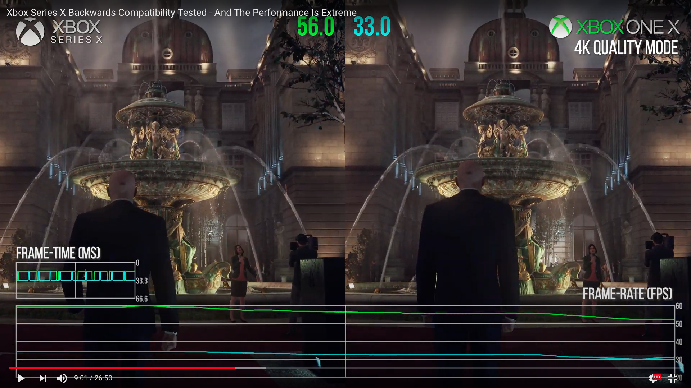

<!-- Headings -->
# Heading 1
## Heading 2
### Heading 3

```markdown
# Heading 1
## Heading 2
### Heading 3
```

<!-- Bold -->
**This text** is bold

```markdown
**This text** is bold
```

<!-- Line -->
---

```markdown
---
***
```

<!-- Blockquote -->
> This is a quote
```markdown
> This is a quote
```

<!-- Links -->
[Google](http://www.google.com "Google site")

```markdown
[Google](http://www.google.com "Google site")
```

<!-- image -->



```markdown


```

<!-- Section -->
* Section 1
* Section 2
	* Section 2-1
	* Section 2-2
* Section 3

```markdown
* Section 1
* Section 2
	* Section 2-1
	* Section 2-2
* Section 3
```

<!-- Ordered Section -->
1. Section 1
	1. Section 1-1
		1. section 1-1-1
1. Section 2
1. Section 3

```markdown
1. Section 1
	1. Section 1-1
		1. section 1-1-1
1. Section 2
1. Section 3
```

<!-- table -->
| Item   | Description |
| ------ | ----------- |
| No.1   | Test1       |
| No.2   | Test2       |

```markdown
| Item   | Description |
| ------ | ----------- |
| No.1   | Test1       |
| No.2   | Test2       |
```

<!-- Inline Code -->
`<p>This is one line code</p>`

```markdown
`<p>This is one line code</p>`
```

<!-- expandable block -->
<details><summary>Click to expand</summary>
<p>
This is a expandable section

```python
print('expanded')
```
</p>
</details>

```markdown
<details><summary>Click to expand</summary>
<p>
This is a expandable section

<!-- Add the code block here -->

</p>
</details>
```